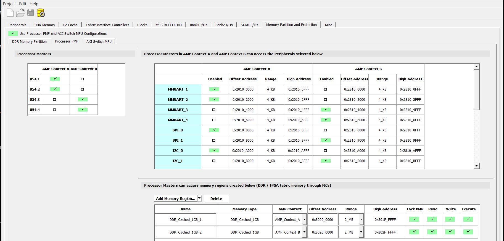
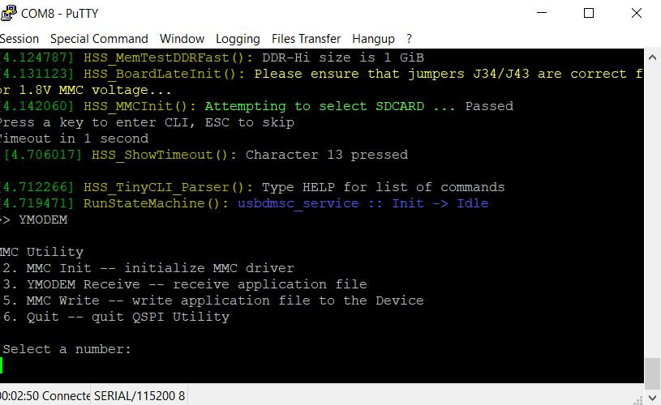
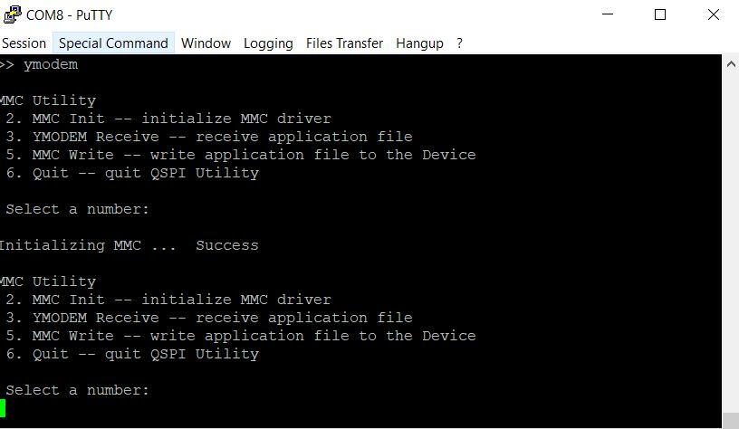
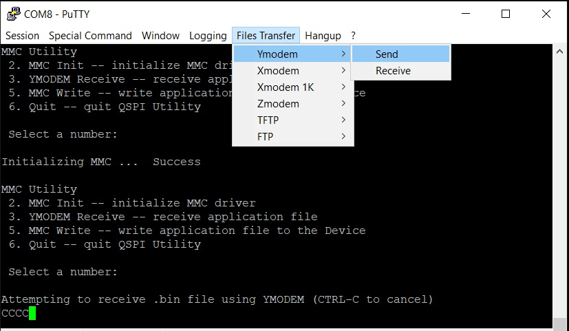
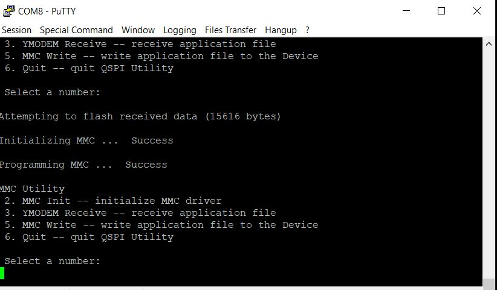
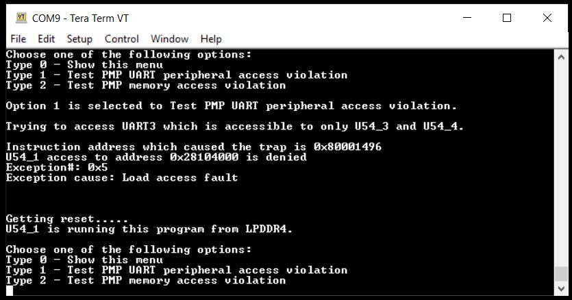
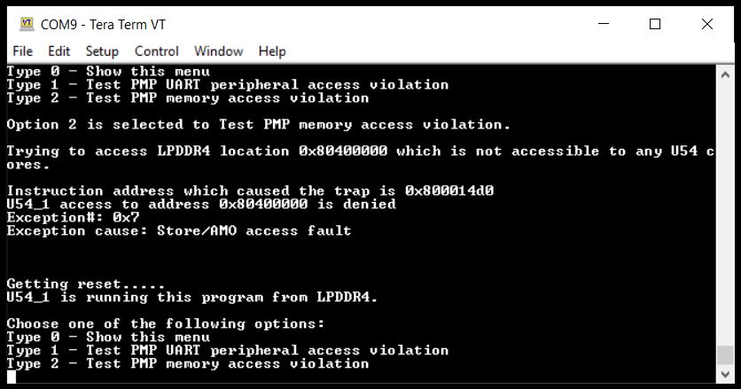

# MPFS PMP Demo

## Objective

The document explains the Physical Memory Protection (PMP) feature supported by MPFS devices using the PolarFire SoC FPGA Icicle Kit.

## Description

To support secure execution of application code, it is necessary to limit the physical addresses accessible by software running on a hardware thread (U54 processor core). The access to physical addresses from each U54 processor core can be restricted using the PMP unit.
The PMP settings defines a finite number of PMP regions, which can be individually configured to enforce access permissions to a range of addresses in memory.
A PMP is applied on the U54 processor cores to allow physical memory access privileges (read, write, and execute).

In this design, PMP is enabled in all the U54 processor cores to restrict the access to memory regions and peripherals not required in a context. This design uses three UART terminals:

* UART0: to display boot logs of the HSS. This terminal is controlled by E51.
* UART1: to display the menu options and trap messages by U54_1.
* UART3: to display the menu options and trap messages by U54_3.

## Requirements

* PolarFire SoC Icicle Kit (MPFS250T_ES-FCVG484E)
* SoftConsole v2021.1
* Libero SoC v2021.1
* Serial Terminal program (extra-putty)
* Host PC - Windows 10 OS

## Pre-Requisite

Before running the user application, make sure to complete the following steps:

* Setting up the jumpers on the Icicle Kit. Refer to the [link](https://mi-v-ecosystem.github.io/redirects/updating-icicle-kit_updating-icicle-kit-design-and-linux).
* Setting up the three Serial Terminal programs "Interface 0 (UART0), Interface 1 (UART1), and Interface 2 (UART2)" using extra-putty:
  * Select the COM ports which are connected to the following interfaces: Silicon Labs Quad CP2108 USB to UART BRIDGE: Interface 0, Interface 1 and Interface 2.
  * Set Baud rate to “115200”, Set Data to 8-bit, Set Flow control to None.
* Use FlashPro Express to program the Icicle Kit with the PolarFire SoC Icicle Kit Reference Design job file. Download the pre-built programming job file [here](https://mi-v-ecosystem.github.io/redirects/releases-icicle-kit-reference-design).

## Enabling PMP in the MSS configurator tool and generate xml file

* Download the icicle-kit-reference-design from [here](https://mi-v-ecosystem.github.io/redirects/releases-icicle-kit-reference-design).
* Extract the downloaded design. Go to the path icicle-kit-reference-design\script_support and open PF_SoC_MSS_Icicle_eMMC.cfg with MSS configurator tool.
* In the PolarFire SoC MSS Configurator > Memory partitions and Protection tab > "Use processor PMP and AXI switch MPU configurations" tick the checkbox to enable PMP.
* In the PolarFire SoC MSS Configurator > Memory Partition and Protection tab > Processor PMP tab, there are two contexts Context A and Context B. Each Context's associations with the U54 processor cores, peripherals and memory regions are configured here. Each peripheral and/or memory region can be protected with access permissions, such as, read, write and execute. The peripheral or memory regions can be enabled in either Context A or in Context B.
  * U54_1 and U54_2 processor cores in Context A.
  * U54_3 and U54_4 processor cores in Context B.
* Save and generate ICICLE_MSS_mss_cfg.xml file.

In this design:

* DDR_Cached_1GB_1 address 0x80000000 and size 2 MB is added to provide memory access (read, write, and execute permissions) for Context A.
* DDR_Cached_1GB_2 address 0x80200000 and size 2 MB is added to provide memory access (read, write, and execute permissions) for Context B.



For more information about PMP see [PolarFire SoC Standalone MSS Configurator User Guide](https://www.microsemi.com/product-directory/soc-design-tools/5587-pfsoc-mss-configurator-tool#documents) and [PolarFire SoC FPGA MSS Technical Reference Manual](https://www.microsemi.com/document-portal/doc_download/1245725-polarfire-soc-fpga-mss-technical-reference-manual).

## Updating HSS with PMP enabled xml

The HSS initializes clocks, memory and peripherals. It also copies the payload.bin file from eMMC/SD to LPDDR4 memory and boots the applications.

### Complete the following steps to update the HSS

* Download the hart-software-services from [here](https://mi-v-ecosystem.github.io/redirects/releases-hart-software-services).
* Replace the existing xml file in the HSS source path (boards/mpfs-icicle-kit-es/soc_fpga_design/xml/) with the PMP enabled ICICLE_MSS_mss_cfg.xml file.
* In the SoftConsole workspace, HSS source code directory, open the .config file and add CONFIG_SERVICE_YMODEM=y to enable ymodem command. Ymodem command is used to load payload.bin using serial terminal(extra-puTTY).
* Rebuild the HSS source [HSS Build instructions here](https://mi-v-ecosystem.github.io/redirects/software-development_polarfire-soc-software-tool-flow)

### Programing latest HSS

Program the eNVM with the updated HSS using SoftConsole with bootmode1 option.

## HSS Payload Generation

The HSS Payload Generator is used to create a formatted payload image from application elf files for the HSS bootloader on PolarFire SoC.  
In this demo, the payload generator takes mpfs-pmp-app-u54-1.elf and mpfs-pmp-app-u54-3.elf as input files and generates the payload.bin file.

**Payload generator tool** Refer to the [link](https://mi-v-ecosystem.github.io/redirects/tool-hss-payload-generator)

**hss-payload-generator Binaries** download from [here](https://mi-v-ecosystem.github.io/redirects/releases-hart-software-services).

### Config File

Create config.yaml file with the following content.

```yaml
set-name: 'PolarFire-SoC-HSS::TestImage'

hart-entry-points: {u54_1: '0x80000000', u54_2: '0xB0000000', u54_3: '0x80200000', u54_4: '0xB0000000'}

payloads:
  mpfs-pmp-app-u54-1.elf:    {exec-addr: '0x80000000', owner-hart: u54_1, priv-mode: prv_m}
  mpfs-pmp-app-u54-3.elf:    {exec-addr: '0x80200000', owner-hart: u54_3, priv-mode: prv_m}
```

### Command to generate payload.bin file

Download mpfs-pmp-app SoftConsole projects from [here](https://mi-v-ecosystem.github.io/redirects/demo-mpfs-pmp-demo) and build.

Copy the mpfs-pmp-app-u54-1.elf, mpfs-pmp-app-u54-3.elf and config.yaml to the directory where hss-payload-generator.exe is located and execute the hss-payload-generator command, as follows.

NOTE: To avoid issues in generating HSS payload on Window's platform, ensure that MSYS2 tool and supporting packages are installed. To install all the packages, Use the "pacman -S libyaml libyaml-devel libelf libelf-devel zlib zlib-devel" command.

```text
$ ./hss-payload-generator -v -c config.yaml payload.bin
Hart Software Service formatted boot image generator v0.99.12
Copyright (c) 2021 Microchip Corporation.

Parsing set-name
Parsing hart entry points
Parsing payload >>mpfs-pmp-app-u54-1.elf<<
Parsing payload >>mpfs-pmp-app-u54-3.elf<<
Set-name is >>PolarFire-SoC-HSS::TestImage<<
Output filename is >>payload.bin<<
Outputting Payload Header
Outputting Code/Data Chunks
Outputting ZI Chunks
Outputting Binary Data
Outputting Payload Header
```

## Running the Application

After the device is programmed, power-cycle the board. The application prints the menu on the extra-putty serial terminal program through the UART0 interface, as shown in following figure.

To run the demo, perform the following steps:

1. Press any key to stop HSS boot.  
  
2. Type "YMODEM" command as shown in the following figure.  
  
3. Type 2 to initialize MMC and check the terminal for SD/eMMC initializing Success. If it failed we can not proceed further.  
  
4. Type 3 to download the payload over YMODEM.  
  
5. On extra-putty, select File > File Transfer > YMODEM > Send to transfer payload.bin as shown in the following figure. The exra-putty: YMODEM Send Dialog appears.  
  
6. Browse the payload.bin file and click Open as shown in the following figure.  
  
7. Type 5 to select MMC Write.  
  
8. Power cycle the board. The HSS will now load the new payload.bin to LPDDR4 and execute.
9. Press 1 in interface 1 serial terminal to test PMP UART peripheral access violation. The U54_1 is trying to access a memory region protected by U54_3. This causes U54_1 to enter the trap with exception 0x5 as shown in following figure.  
  
10. Press 2 in interface 1 serial terminal to test PMP memory access violation. The U54_1 is trying to access LPDDR4 location 0x80400000 which is not accessible to any U54 cores. This causes U54_1 to enter the trap with exception 0x7 as shown in following figure.  
  
11. Follow Steps 9 to Step 10 for similar results on U54_3 using interface  2 serial terminal.

The protected PMP regions can only be released with a system reset. This concludes running the PMP demo on the Icicle Kit.
