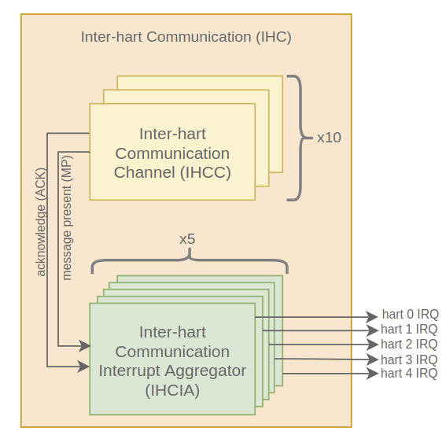
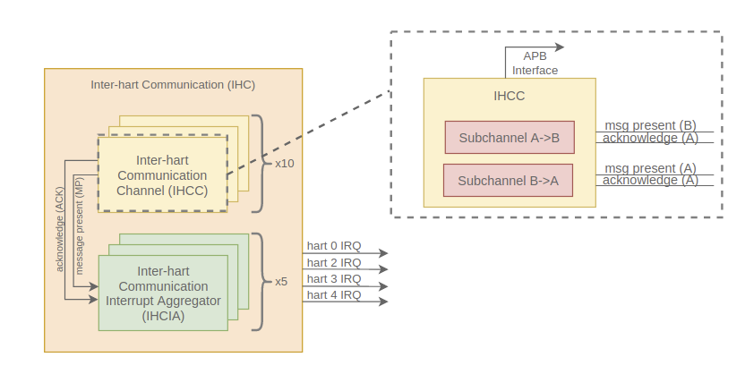
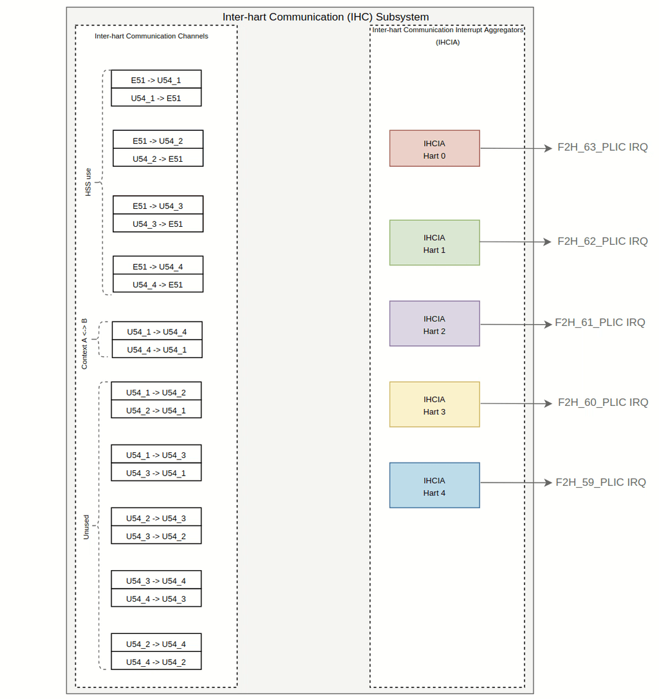

# Mi-V Inter-Hart Communication (IHC) Subsystem

## Table of Contents

- [Introduction](#introduction)
  - [Inter-Hart Communication Channel (IHCC)](#inter-hart-communication-channel-ihcc)
  - [Inter-Hart Communication Interrupt Aggregator (IHCIA)](#inter-hart-communication-interrupt-aggregator-ihcia)
- [IHC Subsystem Configuration](#ihc-subsystem-configuration)
  - [Channel Assignment](#channel-assignment)
  - [Layout](#layout)
- [Associated Software](#associated-software)
  - [Operating Systems](#operating-systems)
    - [Context A to Context B Communication](#context-a-to-context-b-communication)
    - [Context B to Context A Communication](#context-b-to-context-a-communication)

## Introduction

The Inter-Hart Communication (IHC) subsystem can be used to exchange data between harts in PolarFire SoC. It provides the ability to communicate and coordinate between harts through a non-blocking interrupt signaling mechanism.

Internally, the IHC subsystem consists of multiple interconnected instances of the following components:

- **Inter-Hart Communication channels (IHCC)**
- **Inter-Hart Communication interrupt aggregators (IHCIA)**

### Inter-Hart Communication Channel (IHCC)

The Icicle Kit Reference Design's AMP subsystem provides ten Inter-Hart Communication channels (IHCC) of which:

- Four are dedicated for communication between the monitor hart (E51) and applications harts (U54's) using the Hart Software Services (HSS)
- One is assigned for communication between two software contexts at operating system level using the RPMsg protocol

The five remaining channels are not used by the software. These free channels could be used to extend the inter-hart communication if required.

Each IHCC is divided into two unidirectional subchannels that provide a signaling mechanism between a "sender" and a "receiver" hart.

Each subchannel consists of:

- Up to four 32-bit "message out" write-only registers that can be used to send data to the receiving hart.

- Up to four 32-bit "message in" read-only registers that can be used to read a message sent by the sender hart

> The "message in" and "message out" registers could be used to send/receive small amounts of data such as a message ID, a numerical index, a custom control data structure, or a pointer to another location in memory (DDR, LIM, etc.)

- Two associated interrupts:
  - message present interrupt: set when a message posted by the sending processor is available to be consumed on the receiving hart

  - acknowledge interrupt: set when a message posted by the sending processor has been retrieved by the receiving hart

> Note: The purpose of this IHC is to provide a signaling mechanism between harts. Therefore, the actual data to be shared between software contexts should be located in a shared memory area which is not part of the IHC. Some examples of shared memory areas include DDR or LIM.

### Inter-Hart Communication Interrupt Aggregator (IHCIA)

The Inter-Hart Communication Interrupt Aggregator (IHCIA) component has two main purposes:

- Manages interrupts from several channels in order to group them on a hart-level basis

- Provides a mechanism to quickly identify the source IHC channel that sent an interrupt to a particular hart

The IHC subsystem contains five Inter-Hart Communication Interrupt Aggregators (IHCIA's), one for each of the five harts available in PolarFire SoC.

## IHC Subsystem Configuration

This section provides an overview of the default IHC configuration provided in the [Icicle Kit reference design](https://github.com/polarfire-soc/icicle-kit-reference-design).

### Channel Assignment

The table below provides a list of all IHCC's available on PolarFire SoC, as well as the software associated with each of these channels:

| Channel Name     | Software Framework     |
|-------------     |------------------------|
| E51<->U54_1      | HSS                    |
| E51<->U54_2      | HSS                    |
| E51<->U54_3      | HSS                    |
| E51<->U54_4      | HSS                    |
| U54_1<->U54_4    | RPMsg (Context A <-> B)|
| U54_1<->U54_3    | Unused                 |
| U54_1<->U54_2    | Unused                 |
| U54_2<->U54_3    | Unused                 |
| U54_3<->U54_4    | Unused                 |
| U54_2<->U54_4    | Unused                 |

Channels E51<->U54_1, E51<->U54_2, E51<->U54_3 and E51<->U54_4 are used to communicate the monitor hart (E51) with the application harts using the Hart Software Services.

The U54_1 <-> U54_4 channel is assigned for context A to context B communication using the RPMsg protocol.

The above implies that the AMP configuration used should have at least U54_1 assigned to context A and U54_4 assigned to context B.

### Layout

This image below provides a simplified diagram representing the connection between the channels (IHCC's) and the IHCIA's of the IHC subsystem.

For further information on the IHC layout, please refer to the [Icicle Kit Reference Design](https://github.com/polarfire-soc/icicle-kit-reference-design) README.

## Associated Software

### Operating Systems

The IHC is handled by Linux through the Linux mailbox framework and by RTOS/bare metal applications through the bare metal [Mi-V IHC driver]().

The IHC is used by the RPMsg framework to:

a) notify a 'remote' software context that a message has been posted in a ring buffer (vring) located in shared memory

b) send/receive the ring buffer (vring) ID where the sender context posted a message

For more information on the RPMsg framework, please refer to the [RPMsg](https://github.com/polarfire-soc/polarfire-soc-documentation/blob/master/asymmetric-multiprocessing/rpmsg.md) documentation page

#### Context A to Context B Communication

#### Context B to Context A Communication

