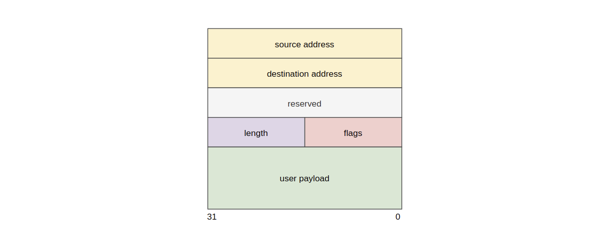
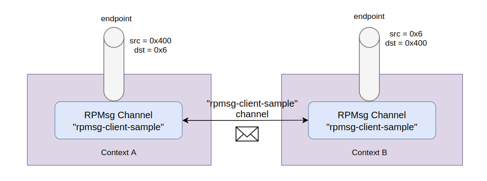
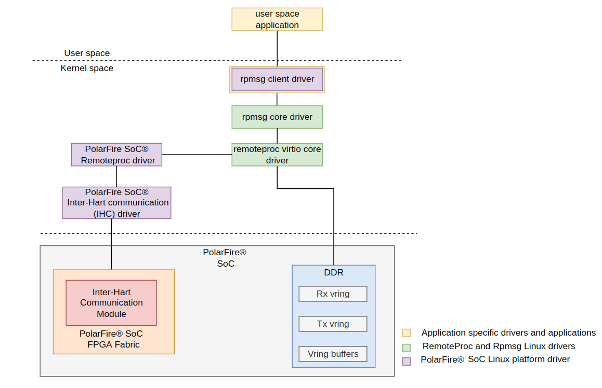
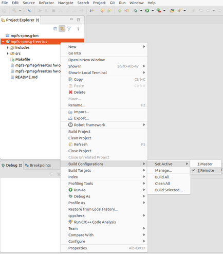

# Remote Processor Messaging (RPMsg)

This page provides a brief introduction to the Remote Processor Messaging (RPMsg) protocol used for inter-hart communication in PolarFire SoC.

- [Remote Processor Messaging (RPMsg)](#remote-processor-messaging-rpmsg)
  - [Introduction to RPMsg](#introduction-to-rpmsg)
    - [Transport Layer](#transport-layer)
      - [Media Access Control (MAC) Layer](#media-access-control-mac-layer)
      - [Physical Layer](#physical-layer)
    - [RPMsg Communication Flow](#rpmsg-communication-flow)
  - [PolarFire SoC RPMsg Linux Support](#polarfire-soc-rpmsg-linux-support)
    - [RPMsg Linux Overview](#rpmsg-linux-overview)
    - [RPMsg Linux Kernel Configuration](#rpmsg-linux-kernel-configuration)
    - [How to use the RPMsg Framework on Linux](#how-to-use-the-rpmsg-framework-on-linux)
  - [PolarFire SoC RPMsg on FreeRTOS/Bare Metal](#polarfire-soc-rpmsg-on-freertosbare-metal)
    - [FreeRTOS + Bare Metal RPMsg Communication](#freertos--bare-metal-rpmsg-communication)
      - [Generating the FreeRTOS + BM AMP Payload](#generating-the-freertos--bm-amp-payload)
    - [FreeRTOS + FreeRTOS RPMsg Communication](#freertos--freertos-rpmsg-communication)
      - [Generating the FreeRTOS + FreeRTOS AMP Payload](#generating-the-freertos--freertos-amp-payload)
    - [Bare Metal + Bare Metal RPMsg Communication](#bare-metal--bare-metal-rpmsg-communication)
      - [Generating the BM + BM AMP Payload](#generating-the-bm--bm-amp-payload)

<a name="introduction-to-rpmsg"></a>

## Introduction to RPMsg

The Remote Processor Messaging (RPMsg) is a protocol that is used to send and receive messages between software contexts in an AMP system.

There are multiple implementations of the RPMsg protocol:

- [Linux RPMsg framework](https://www.kernel.org/doc/html/latest/staging/rpmsg.html)
- [OpenAMP RPMsg framework](https://github.com/OpenAMP/open-amp)
- [RPMsg-lite framework](https://nxpmicro.github.io/rpmsg-lite/index.html)

PolarFire SoC currently supports the RPMsg framework for Linux software contexts and the RPMsg-lite for RTOS/BM contexts.

The RPMsg communication stack can be divided in three layers - Transport, Media Access Control (MAC) and Physical Layer.


The following sections describe each of the RPMsg layers.

<a name="transport-layer"></a>

### Transport Layer

The Transport layer is the actual implementation of the RPMsg protocol. This layer defines the format of the message, the creation of communication channels and endpoints, as well as an API to send and receive messages from other software contexts.



A RPMsg **channel** provides a bidirectional communication link between two software contexts. A RPMsg channel is composed of a textual name, a destination and a source address.

A RPMsg **endpoint** provides a logical connection on top of an RPMsg channel. An endpoint has an associated call-back function that is triggered when data is received on that endpoint. Each endpoint has a unique local address.

Endpoints allow the user to bind multiple user callbacks within a single RPMsg channel.



<a name="media-access-control-mac-layer"></a>

#### Media Access Control (MAC) Layer

The Media Access Control (MAC) layer makes use of the VirtIO I/O virtualization framework to manage shared memory.

The VirtIO layer uses a communication abstraction known as a "virtqueue" to transfer data to/from shared memory. Internally, virtqueues use a ring buffer mechanism known as a vring.

Vrings reside in shared memory and contain buffer descriptors which point to actual buffers that are exchanged between the master and remote contexts.

Vrings are uni-directional, one vring is dedicated to transmit a message to the remote processor, and the other vring is used to receive messages from the remote processor.


For more information on the VirtIO framework, please refer to the [OpenAMP RPMsg VirtIO implementation](https://github.com/OpenAMP/open-amp/wiki/OpenAMP-RPMsg-Virtio-Implementation).

<a name="physical-layer"></a>

#### Physical Layer

The Physical layer is composed of two basic hardware components: shared memory and an inter-core notification mechanism.

With regards to shared memory, PolarFire SoC has some reserved memory area in DDR memory dedicated for inter-hart communication.

In addition to this, PolarFire SoC provides a dedicated Inter-Hart Communication (IHC) subsystem that allows software contexts to communicate and coordinate with each other through  a non-blocking interrupt signaling mechanism.

For more information on the IHC subsystem, please refer to the [IHC subsystem documentation](ihc.md) page.

<a name="rpmsg-communication-flow"></a>

### RPMsg Communication Flow

The RPMsg protocol establishes a master-remote communication flow as shown in the image below:


The RPMsg-lite framework for RTOS/bare metal applications supports Master and Remote modes, whereas the Linux RPMsg Framework supports master mode only.

<a name="polarfire-soc-rpmsg-linux-support"></a>

## PolarFire SoC RPMsg Linux Support

<a name="rpmsg-linux-overview"></a>

### RPMsg Linux Overview

On the Linux side, the RPmsg Framework relies on the interaction of following components:

- **Remoteproc core drivers**: Framework that allows to start, stop and load firmware to the remote AMP context.
  This framework also adds rpmsg support for sharing messages with a remote AMP by using the Linux remoteproc virtio driver.

- **Remoteproc virtio core driver**: VirtIO implementation used by the RPMsg protocol. Its implementation is based on a shared ring buffer (vring).

- **RPMsg core driver**: implementation of the RPMsg layer in Linux.

- **Rpmsg client driver** : a client driver that implements a specific service to communicate with the remote processor. Some of them may expose user space interfaces if needed. Some examples include the RPMsg TTY client driver and the RPMsg char driver.

- **Mi-V Remoteproc driver**: Remoteproc platform driver for Mi-V SoCs.

- **Mi-V Inter-Hart communication (IHC) driver**: Linux driver that interacts with the Mi-V Inter-Hart Communication (IHC) subsystem.



<a name="rpmsg-linux-kernel-configuration"></a>

### RPMsg Linux Kernel Configuration

The RPMsg framework is automatically enabled when the remote `MIV_REMOTEPROC` configuration is enabled.

This option is already configured in the PolarFire SoC Yocto and Buildroot build systems when using the AMP machine.

<a name="how-to-use-the-rpmsg-framework-on-linux"></a>

### How to use the RPMsg Framework on Linux

PolarFire SoC includes several client drivers which can be used to interact with a remote software context.

- [RPMsg tty client driver](rpmsg-client-drivers.md)
- [RPMsg char client driver](rpmsg-client-drivers.md)
- [RPMsg client sample driver](rpmsg-client-drivers.md)

<a name="polarfire-soc-rpmsg-on-freertosbare-metal"></a>

## PolarFire SoC RPMsg on FreeRTOS/Bare Metal

PolarFire SoC uses the RPMsg-lite implementation on RTOS and bare metal (BM) software contexts.

The [PolarFire SoC AMP examples](https://mi-v-ecosystem.github.io/redirects/repo-polarfire-soc-amp-examples) repository contains FreeRTOS and Bare metal sample projects that can be used to communicate with a remote software (i.e. Linux or another BM/FreeRTOS context) using the RPMsg-lite framework.

The projects contain two different build configurations:

- **Remote Build Configuration**: Builds an application in RPMsg Remote mode.

- **Master Build Configuration**: Builds an application in RPMsg Master mode.

Different combinations of operating systems can be supported in a master and remote role. For instance:

- FreeRTOS (master) + FreeRTOS (remote)

- FreeRTOS (master) + Bare Metal (remote)

- Bare Metal (master) + Bare Metal (remote)

- Linux (master) + FreeRTOS (remote)

<a name="freertos--bare-metal-rpmsg-communication"></a>

### FreeRTOS + Bare Metal RPMsg Communication

#### Building the FreeRTOS + BM AMP Demo

This section focuses on how to get a FreeRTOS and a bare metal context to communicate with each other using RPMsg.

To do this, it is necessary to build the RPMsg FreeRTOS and bare metal projects as shown in the following steps:

1. Clone the PolarFire SoC AMP examples repository

    ```bash
    git clone https://github.com/polarfire-soc/polarfire-soc-amp-examples.git
    ```

2. Import the `mpfs-rpmsg-freertos` and `mpfs-rpmsg-bm` projects into a SoftConsole workspace

3. Build the mpfs-rpmsg-freertos project in master mode by clicking the dropdown button next to the build button and select `Master`

    

    This should generate a Master-Default folder with the output files resulting from the compilation.

4. Build the `mpfs-rpmsg-bm` project in remote mode by clicking the dropdown button next to the build button and select `Remote`

    

This should generate a Remote-Default folder with the output files resulting from the compilation.

<a name="generating-the-freertos--bm-amp-payload"></a>

#### Generating the FreeRTOS + BM AMP Payload

The polarfire-soc-amp-examples repository provides a resources/ folder with a sample HSS payload generator YAML file to build the FreeRTOS + BM AMP demo.

1. Download the hss-payload-generator from the Hart Software Services [releases](https://mi-v-ecosystem.github.io/redirects/releases-hart-software-services).

2. Copy the payload generator binary into the resources folder

3. Open a terminal and execute the following commands:

    ```bash
    cd polarfire-soc-amp-examples/resources
    hss-payload-generator -c hss-payload-freertos_bm.yaml payload.bin
    ```

4. Flash the payload from the tools/ directory to eMMC or SD-card following the steps shown in the [Updating PolarFire SoC Icicle-Kit FPGA Design and Linux Image](https://mi-v-ecosystem.github.io/redirects/updating-icicle-kit_updating-icicle-kit-design-and-linux) document to program using USBImager or, for example, using dd on Linux:

    ```bash
    sudo dd if=payload.bin of=/dev/sdX
    ```

    > Be very careful while picking /dev/sdX device! Look at dmesg, lsblk, GNOME Disks, etc. before and after plugging in your USB flash device/uSD/SD to find a proper device. Double check it to avoid overwriting any of system disks/partitions!

5. On power-on, the Icicle Kit should boot the HSS and start the application in each context.

6. The FreeRTOS context with RPMsg in master mode will display a menu on UART 1. Select between the list of available demos from the menu.

7. The bare metal context with RPMsg in remote mode will display the same menu as described in the step above on UART 3. Select the same demo as chosen on the step above.

    

For instance, the image on the right-hand side above, shows the RPMsg application menu when in remote mode. In this case, option two was chosen to run the console demo. This same demo should be selected on the RPMsg master application to run the counterpart of the console demo on the master side.

<a name="freertos--freertos-rpmsg-communication"></a>

### FreeRTOS + FreeRTOS RPMsg Communication

#### Building the FreeRTOS + FreeRTOS AMP Demo

This section focuses on how to get two FreeRTOS contexts to communicate with each other using RPMsg.

To do this, it is necessary to build the RPMsg FreeRTOS project using both master and remote build configurations as shown in the following steps:

1. Clone the PolarFire SoC AMP examples repository

    ```bash
    git clone https://github.com/polarfire-soc/polarfire-soc-amp-examples.git
    ```

2. Import the `mpfs-rpmsg-freertos` project into a SoftConsole workspace

3. Build the project in master mode by clicking the dropdown button next to the build button and select `Master`

    

    This should generate a Master-Default folder with the output files resulting from the compilation.

4. Build the project in remote mode by clicking the dropdown button next to the build button and select `Remote`

    

This should generate a Remote-Default folder with the output files resulting from the compilation.

<a name="generating-the-freertos--freertos-amp-payload"></a>

#### Generating the FreeRTOS + FreeRTOS AMP Payload

The polarfire-soc-amp-examples repository provides a resources/ folder with a sample HSS payload generator YAML file to build the FreeRTOS + FreeRTOS AMP demo.

1. Download the hss-payload-generator from the Hart Software Services [releases](https://mi-v-ecosystem.github.io/redirects/releases-hart-software-services).

2. Copy the payload generator binary into the resources folder

3. Open a terminal and execute the following commands:

    ```bash
    cd polarfire-soc-amp-examples/rresources
    hss-payload-generator -c hss-payload-freertos_freertos.yaml payload.bin
    ```

4. Flash the payload from the tools/ directory to eMMC or SD-card following the steps shown in the [Updating PolarFire SoC Icicle-Kit FPGA Design and Linux Image](https://mi-v-ecosystem.github.io/redirects/updating-icicle-kit_updating-icicle-kit-design-and-linux) document to program using USBImager or, for example, using dd on Linux:

    ```bash
    sudo dd if=payload.bin of=/dev/sdX
    ```

    > Be very careful while picking /dev/sdX device! Look at dmesg, lsblk, GNOME Disks, etc. before and after plugging in your USB flash device/uSD/SD to find a proper device. Double check it to avoid overwriting any of system disks/partitions!

5. On power-on, the Icicle Kit should boot the HSS and start the application in each context.

6. The FreeRTOS context with RPMsg in master mode will display a menu on UART 1. Select between the list of available demos from the menu.

7. The FreeRTOS context with RPMsg in remote mode will display the same menu as described in the step above on UART 3. Select the same demo as chosen on the step above.

    

For instance, the image on the right-hand side above, shows the RPMsg application menu when in remote mode. In this case, option two was chosen to run the console demo. This same demo should be selected on the RPMsg master application to run the counterpart of the console demo on the master side.

<a name="bare-metal--bare-metal-rpmsg-communication"></a>

### Bare Metal + Bare Metal RPMsg Communication

#### Building the Bare Metal + Bare Metal AMP Demo

This section focuses on how to get two bare metal contexts to communicate with each other using RPMsg.

To do this, it is necessary to build the RPMsg bare metal project using both master and remote build configurations as shown in the following steps:

1. Clone the PolarFire SoC AMP examples repository

    ```bash
    git clone https://github.com/polarfire-soc/polarfire-soc-amp-examples.git
    ```

2. Import the `mpfs-rpmsg-bm` project into a SoftConsole workspace

3. Build the project in master mode by clicking the dropdown button next to the build button and select `Master`

    

    This should generate a Master-Default folder with the output files resulting from the compilation.

4. Build the project in remote mode by clicking the dropdown button next to the build button and select `Remote`

    

This should generate a Remote-Default folder with the output files resulting from the compilation.

<a name="generating-the-bm--bm-amp-payload"></a>

#### Generating the BM + BM AMP Payload

The polarfire-soc-amp-examples repository provides a resources/ folder with a sample HSS payload generator YAML file to build the BM + BM AMP demo.

1. Download the hss-payload-generator from the Hart Software Services [releases](https://mi-v-ecosystem.github.io/redirects/releases-hart-software-services).

2. Copy the payload generator binary into the resources folder

3. Open a terminal and execute the following commands:

    ```bash
    cd polarfire-soc-amp-examples/resources
    hss-payload-generator -c hss-payload-bm_bm.yaml payload.bin
    ```

4. Flash the payload from the tools/ directory to eMMC or SD-card following the steps shown in the [Updating PolarFire SoC Icicle-Kit FPGA Design and Linux Image](https://mi-v-ecosystem.github.io/redirects/updating-icicle-kit_updating-icicle-kit-design-and-linux) document to program using USBImager or, for example, using dd on Linux:

    ```bash
    sudo dd if=payload.bin of=/dev/sdX
    ```

    > Be very careful while picking /dev/sdX device! Look at dmesg, lsblk, GNOME Disks, etc. before and after plugging in your USB flash device/uSD/SD to find a proper device. Double check it to avoid overwriting any of system disks/partitions!

5. On power-on, the Icicle Kit should boot the HSS and start the application in each context.

6. The bare metal context with RPMsg in master mode will display a menu on UART 1. Select between the list of available demos from the menu.

7. The bare metal context with RPMsg in remote mode will display the same menu as described in the step above on UART 3. Select the same demo as chosen on the step above.

    

For instance, the image on the right-hand side above, shows the RPMsg application menu when in remote mode. In this case, option two was chosen to run the console demo. This same demo should be selected on the RPMsg master application to run the counterpart of the console demo on the master side.
