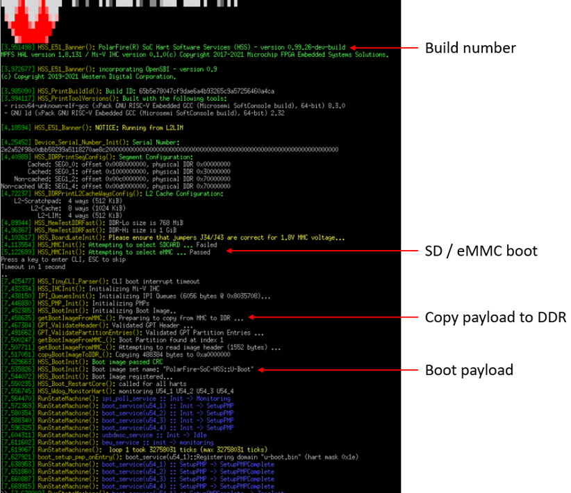
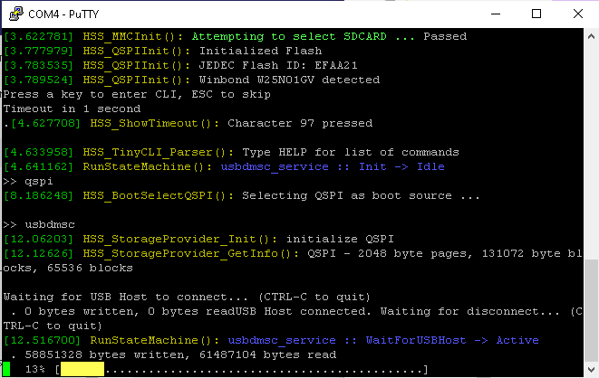

# Updating MPFS Kit

## Table of Contents

- [Updating MPFS Kit](#updating-mpfs-kit)
  - [Table of Contents](#table-of-contents)
  - [Introduction](#introduction)
  - [Requirements](#requirements)
  - [Tested on](#tested-on)
  - [Pre-Requisites](#pre-requisites)
  - [Updating](#updating)
    - [FPGA fabric and eNVM](#fpga-fabric-and-envm)
    - [Linux image](#linux-image)
      - [Programming the Linux Image](#programming-the-linux-image)
        - [eMMC](#emmc)
          - [eMMC content update procedure](#emmc-content-update-procedure)
        - [SD Card content update procedure](#sd-card-content-update-procedure)
        - [External QSPI Flash Memory](#external-qspi-flash-memory)
          - [External QSPI Flash Content Update Procedure](#external-qspi-flash-content-update-procedure)

## Introduction

This document provides instructions to program / update a PolarFire SoC development kit to boot Linux.

## Requirements

- A reference design, including the HSS boot loader
- On board eMMC, an SD card or QSPI flash to be programmed with a Linux image

## Tested on

The steps outlined in this document have been tested on a PolarFire SoC Icicle Kit.

## Pre-Requisites

- [FlashPro Express](https://www.microchip.com/en-us/products/fpgas-and-plds/fpga-and-soc-design-tools/programming-and-debug#Download%20Software) is required to program an FPGA bitstream to a target development kit. FlashPro Express can be installed as a standalone tool with the Program and Debug tools and is also installed with Libero SoC.

- [USBImager](https://bztsrc.gitlab.io/usbimager/) is required to program a Linux image to a target memory using the Hart Software Services.

## Updating

### FPGA fabric and eNVM

A FlashPro Express programming job file is provided as an asset with each release of a kit's reference design in the PolarFire SoC GitHub organisation - kit user guides should be consulted for links to the reference design repositories for indivdiual kits.
These programming job files will program the FPGA fabric with the latest reference configuration and also program the eNVM with the latest HSS payload.
The .zip file in the release assets should be downloaded and extracted to access the programming job file.

### Linux image

The [Meta PolarFire SoC Yocto BSP](https://mi-v-ecosystem.github.io/redirects/repo-meta-polarfire-soc-yocto-bsp) and [Microchip Buildroot External](https://mi-v-ecosystem.github.io/redirects/repo-microchip-buildroot-external) repositories allow users to create a minimal Linux image for several development kits. Alternatively, a pre-built minimal Linux image is provided as an asset in the Meta PolarFire SoC Yocto BSP releases [page](https://mi-v-ecosystem.github.io/redirects/releases-meta-polarfire-soc-yocto-bsp).

Linux images with a '.wic' or ".wic.gz" file extension use a GUID partition table (GPT) and are suitable for programming to the eMMC or an SD card. For Microchip Buildroot External, an image with the name `sdcard.img` is use instead. For more information on how to program any of these images into storage, plese refer to the steps outlined in the [eMMC](#emmc) or [SD](#sd-card-content-update-procedure) sections.

Linux images created using the PolarFire SoC Yocto BSP layer and named per the `<image>-<machine>-<timestamp>.<flash-type>.mtdimg` format, for example, `core-image-minimal-mtdutils-icicle-kit-es-yyyyMMddHHmmSS.nand.mtdimg` or `core-image-minimal-mtdutils-icicle-kit-es-yyyyMMddHHmmSS.nor.mtdimg` are suitable for programming to a QSPI flash device using the HSS. For Microchip Buildroot External, images with the name `nand.img` or `nor.img` are used instead.

For more information on how to program images to QSPI flash devices, please follow the steps outlined in the [External QSPI Flash Memory](#external-qspi-flash-memory) section.

When updating a kit as shown in this section, make sure to keep both the reference design and Linux image versions in sync by using the latest release assets.

#### Programming the Linux Image

##### eMMC

A PolarFire SoC kit's eMMC content is written by the Hart Software Services (HSS) using the `usbdmsc` command. The HSS `usbdmsc` command exposes the eMMC as a USB mass storage device through a USB-OTG connector.

If both QSPI and MMC services are enabled in the HSS, you must specify the default device to be programmed before running the `usbdmsc` command. For example, to program the eMMC using USBDMSC service, you must enter the `mmc` command before running the `usbdmsc` command.

###### eMMC content update procedure

1. Connect the USB-UART connector to your host PC. This connection will give you access to the PolarFire SoC UARTs
2. Open a terminal application to interact with the HSS through MMUART0. Settings are 115200 baud, 8 data bits, 1 stop bit, no parity, and no flow control.
3. Power on the board and the Microchip logo will be displayed on MMUART0 as the HSS boots.
4. Press a key in the terminal application to stop the HSS from booting. This will give you access to the HSS command line interface and a ">>" for input will be displayed in the terminal.
5. Type `mmc` to select mmc as a boot source and then `usbdmsc` in the HSS command line interface. If successful, a message saying "Waiting for USB Host to connect" will be displayed.
6. Connect the USB-OTG connector to your host PC. The eMMC content will be transferred to the kit through this connection.
7. The eMMC should now appear as mass storage device/drive on your host PC.
8. Download the asset for the Linux image that you want to program to the kit from the Meta PolarFire SoC Yocto BSP [releases](https://mi-v-ecosystem.github.io/redirects/releases-meta-polarfire-soc-yocto-bsp) or use [Microchip Buildroot External](https://mi-v-ecosystem.github.io/redirects/repo-microchip-buildroot-external) to create a `sdcard.img` image.
9. If using an image generated with the Meta PolarFire SoC Yocto BSP, please extract the image so it has the ".wic" extension - compressed images, i.e with the ".wic.gz" extension should not be programmed as this can cause issues at boot time.
10. Launch USBImager

    

11. Select the *Image file* you would like to program to the eMMC. Note: Linux images are generated with a time stamp; assets from different releases will have different names.

    

12. Select the target *Device* to program the image to.

    

13. Click *Write*.

    

14. Once writing has completed, unmount/eject the drive from the host PC and press `CTRL+C` in the HSS command line interface. Disconnect the micro-USB cable from the USB-OTG connector.
15. Type `boot` to boot the newly copied Linux image.
16. HSS boot messages will appear on MMUART0 and the Linux boot will appear on MMUART1.

##### SD Card content update procedure

1. Put an SD card into the SD card reader of your host PC and use the instructions below.

2. Download the asset for the Linux image that you want to program to the kit from the Meta PolarFire SoC Yocto BSP [releases](https://mi-v-ecosystem.github.io/redirects/releases-meta-polarfire-soc-yocto-bsp) or use the [Microchip Buildroot External](https://mi-v-ecosystem.github.io/redirects/repo-microchip-buildroot-external) to create a `sdcard.img` image.

3. If using an image generated from the Meta PolarFire SoC Yocto BSP, extract the image so it has the ".wic" extension - compressed images, i.e with the ".wic.gz" extension should not be programmed as this can cause issues at boot time.

4. Launch USBImager

    

5. Select *Image file* that was extracted in step 3. Note: Yocto Linux images are generated with a time stamp, assets from different releases will have different names.

    

6. Select the *Device*.

    

7. Click *Write*.

    

8. Once writing has completed, eject the SD card from the host PC.
9. Insert the SD card into the kit's SD card slot and power on the board.
10. HSS boot messages will appear on MMUART0 and the Linux boot will appear on MMUART1. The expected HSS output for a successful boot from eMMC is shown below:

    

11. To verify the Linux image that has been programmed the bundled webserver demo can be run. Instructions for running this demo can be found in the quick start guide for individual boards.

##### External QSPI Flash Memory

PolarFire SoC supports booting Linux from QSPI by connecting an external QSPI flash memory.

For more information on the QSPI flash memory devices supported, please refer to the [booting from QSPI](https://mi-v-ecosystem.github.io/redirects/booting-from-qspi_booting-from-qspi) documentation.

The external QSPI flash memory can be programmed using the Hart Software Services (HSS) using the `usbdmsc` command. The HSS `usbdmsc` command exposes the QSPI flash memory as a USB mass storage device through the USB-OTG connector.

If both QSPI and an MMC services are enabled in the HSS, you must specify the default device to be programmed before running the `usbdmsc` command. For example, to program the external QSPI flash memory using USBDMSC service, you must use the `qspi` command before running `usbdmsc` command.

###### External QSPI Flash Content Update Procedure

1. Connect the USB-UART connector to your host PC. This connection will give you access to 4 of the PolarFire SoC UARTs
2. Open a terminal application to interact with the HSS through MMUART0. Settings are 115200 baud, 8 data bits, 1 stop bit, no parity, and no flow control.
3. Power on the board and the Microchip logo will be displayed on MMUART0 as the HSS boots.
4. Press a key in the terminal application to stop the HSS from booting. This will give you access to the HSS command line interface and a ">>" for input will be displayed in the terminal.
5. Type `qspi` to select QSPI as the boot source  and then type `usbdmsc` in the HSS command line interface. If successful, a message saying "Waiting for USB Host to connect" will be displayed.
6. Connect the USB-OTG connector to your host PC. The content will be transferred to the external QSPI flash memory through this connection.
7. The QSPI flash connected to the kit should now appear as mass storage device/drive on your host PC.
8. Download the asset for the Linux image that you want to program to the kit from the Meta PolarFire SoC Yocto BSP [releases](https://mi-v-ecosystem.github.io/redirects/releases-meta-polarfire-soc-yocto-bsp). The asset should have a `.mtdimg` file extension. Alternatively, create a "nand.img" or "nor.img" image using [Microchip Buildroot External](https://mi-v-ecosystem.github.io/redirects/repo-microchip-buildroot-external).
9. Launch USBImager

    

10. Select the *Image file* that was downloaded in step 8. Note: Yocto Linux images are generated with a time stamp; assets from different releases will have different names.

    

11. Select the target *Device* to program the image to.

    

12. Click *Write*.

    

13. Once writing has completed, unmount/eject the drive from the host PC and press `CTRL+C` in the HSS command line interface. Disconnect the micro-USB cable from the USB-OTG connector.

14. A progress bar will show up, indicating that the image is being transfered to the QSPI flash that is connected.

    

15. Once the transfer has completed, the HSS console shoud look as shown in the image below

    

16. Type `boot` to boot the newly copied Linux image.

17. HSS boot messages will appear on MMUART0 and the Linux boot will appear on MMUART1.
