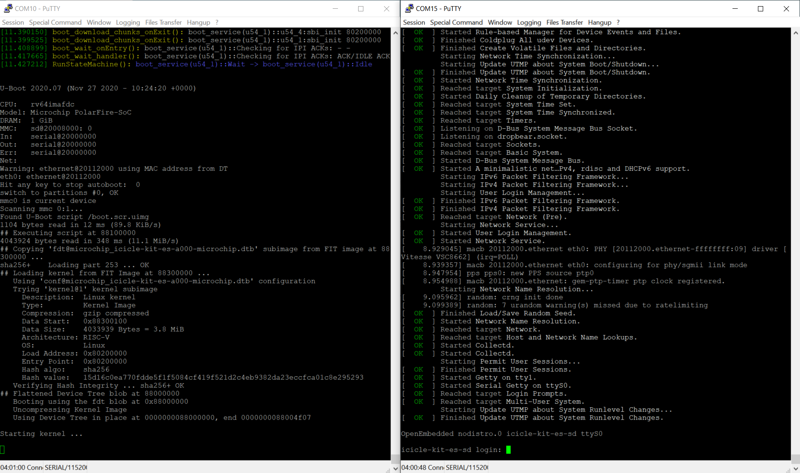

# Icicle Kit Software Developer Guide

[**Coming soon...**](https://www.crowdsupply.com/microchip/polarfire-soc-icicle-kit) 

## Connectors

 

## Coming out of the box
The board is pre-programmed with a reference design booting Linux from eMMC.

Connect the Icicle Kit's  *USB- UART Terminal* connector (J11) to your host computer, Use the terminal software of your choice (Putty, ExtraPutty, minicom, screen) to open serial connections to the four UARTs available though the J11 USB connector. **Serial port setting: 115220 baud, no flow control, no parity**. Power cycle the board. This should result in boot messages appearing on two of the serials ports.

 

One terminal displays the Hart Software Service (HSS) boot messages. The second terminal displays the U-Boot and Linux boot messages and provides a Linux prompt. Login using user name "root".

## Reprogramming With The Latest Reference Design
The document [Updating PolarFire SoC Icicle Kit FPGA Design and Linux Image](https://github.com/polarfire-soc/polarfire-soc-documentation/blob/master/boards/mpfs-icicle-kit-es/updating-icicle-kit/updating-icicle-kit-design-and-linux.md)  provides links to the FPGA programming files and pre-built Linux images for the Icicle Kit's reference design.

## Reference
[Polarfire-SoC Yocto Board Support Package](https://github.com/polarfire-soc/meta-polarfire-soc-yocto-bsp) 

[PolarFire SoC Buildroot Linux Software Development Kit](https://github.com/polarfire-soc/polarfire-soc-buildroot-sdk) 

[PolarFire SoC Icicle Kit Schematics (Preliminary)](https://www.microsemi.com/document-portal/doc_download/1244587-polarfire-soc-icicle-kit-schematics) 
