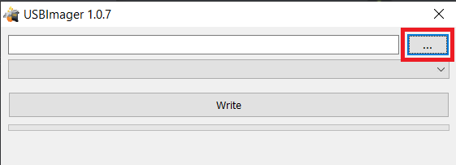
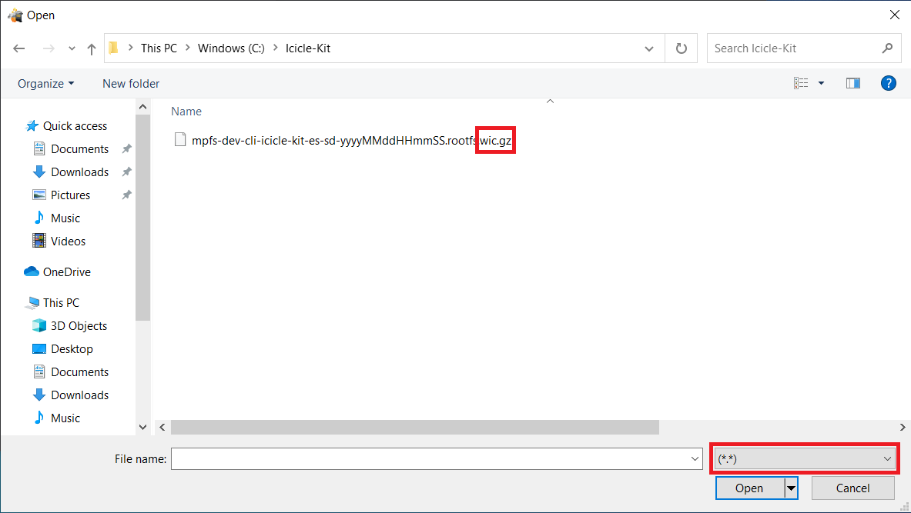

# Updating PolarFire SoC  Icicle-Kit FPGA Design and Linux Image

- [Programming Files and Linux Images Links](#Links)
- [Jumper Settings](#Jumpers)
- [Serial Ports](#Serial-Ports)
- [Linux Credentials](#Credentials)
- [Programming The PolarFire SoC Design](#Programming-Design)
- [Programming the Linux Image](#Programming-Linux-Image)
    - [eMMC](#eMMC)
    - [SD Card](#SD-Card)
        - [Linux Host](#Linux-Host)
            - [Unmount any partitions from the SD card](#Unmount)
            - [Copy the wic image to the SD card](#Copy-wic)
        - [Windows Host](#Windows-Host)
- [Tools and References](#Tools-References)

This document provides links to files and instructions to provision an Icicle Kit to boot Linux. To achieve this:
- The PolarFire SoC Icicle Kit reference design, including the HSS boot loader must be programmed to the kit
- The on board eMMC or an SD card need to be programmed with a Linux image

<a name="Links"></a>
##  Programming Files and Linux Images Links
All programming files and Linux images are now being provided as assets with each release of their respective repositories.

Icicle Kit Reference Design programming files (including the HSS) are available as assets [here](https://github.com/polarfire-soc/icicle-kit-reference-design/releases).

Yocto Linux images are available as assets [here](https://github.com/polarfire-soc/meta-polarfire-soc-yocto-bsp/releases).

**Note:**
From release 2020.11, the SoC-FPGA programming files are identical for SD card and eMMC since Linux can be booted from either SD card or eMMC using the 2020.11 HSS and Icicle Kit reference design release.

<a name="Jumpers"></a>
## Jumper Settings
The Icicle Kit jumper settings required to boot Linux are as follows:

|   Jumper  |  Setting |
| --------- | -------- |
|    J15    |   Open   |
|    J17    |   Open   |
|    J24    |   Open   |
|    J28    |  Closed  |
|    J31    |   Open   |
|    J34    |  1 & 2   |
|    J35    |  1 & 2   |
|    J43    |  1 & 2   |
|    J45    |  1 & 2   |
|    J46    |  Closed  |

### FlashPro Jumpers

|   Jumper  |  Description                                                         |
| --------- | -------------------------------------------------------------------- |
|    J9     |   Used to select between Embedded FlashPro6 and external FlashPro header.            |
|           |     Closed: Embedded FlashPro6 connected to J33 micro USB port. |
|           |     Open: External FlashPro connected to J23 header.              |
|    J21    |   JTAG nTRST interface pull down enable. Leave open.                 |

<a name="Serial-Ports"></a>
## Serial Ports
Please note that the first two serial ports available from the J11 USB-UART connector are used when booting Linux. The first UART displays zero stage bootloader and U-Boot messages, the second UART displays Linux messages and a console.

Serial ports settings: 115200 baud, 8-bit, no flow control.

<a name="Credentials"></a>
## Linux Credentials
You can login to the board using 'root' as user name, there is no password by default. If one is requested 'microchip' is used by default.

<a name="Programming-Design"></a>
## Programming The PolarFire SoC Design
Please use FlashPro Express to program the PolarFire SoC design to the Icicle Kit.

<a name="Programming-Linux-Image"></a>
## Programming the Linux Image
<a name="eMMC"></a>
### eMMC
The Icicle Kit's eMMC content is written by the Hart Software Services (HSS) using the `usbdmsc` command. The HSS `usbdmsc` command exposes the eMMC as a USB mass storage device through the Icicle Kit's USB-OTG J16 connector located beside the SD card slot.

#### eMMC content update procedure

1. Connect the J11 USB-UART connector to your host PC. This is the micro-USB connector on the same side as the Ethernet connectors. This connection will give you access to 4 of the PolarFire SoC UARTs
2. Open a terminal application to interact with the HSS through UART0. Settings are 115200 baud, 8 data bits, 1 stop bit, no parity, and no flow control.
3. Power cycle the board.
4. Type a key in the terminal application to stop the HSS from booting. This will give you access to the HSS command line interface.
5. Type `usbdmsc` in the HSS command line interface. This will expose the eMMC as a mass storage device through the USB-OTG connector.
6. Connect the J16 USB-OTG connector to your host PC. The eMMC content will be transfered to the Icicle Kit through this connection.
7. The Icicle Kit should now appear as mass storage device/drive on your host PC.
8. Use the same procedure to write the eMMC as the one for writing an SD-card depending whether your host PC uses [Windows](#Windows-Host) or [Linux](#Linux-Host).
9. Once the Linux image is copied to the eMMC, press `CTRL+C` in the HSS command line interface, then type `boot` to boot the newly copied Linux image.

<a name="SD-Card"></a>
### SD Card
Put an SD card into the SD card reader of your host PC and use the instructions below depending on your host PC's operating system.

<a name="Linux-Host"></a>
#### Linux Host

<a name="Unmount"></a>
##### Unmount any partitions from the SD card
Find out which partitions were mounted, if any, for the SD card. This can be done by using the following command before and after plugging the SD card into your host PC:
```
ls /dev/sd*
```

Identify which new partitions appear after pluging in the SD card. For example:
```
/dev/sdc  /dev/sdc1  /dev/sdc2  /dev/sdc3
```
Use the following command to unmount the SD card replacing /dev/sdX with the drive letter found in the previous step. For example, "/dev/sd**c**?" from the example above.


```
sudo umount /dev/sdX?
```

<a name="Copy-wic"></a>
##### Copy the wic image to the SD card
Copy the Linux image of your choice to the SD card using the command below, replacing /dev/sdX with actual SD card drive name and &lt;linux-image&gt; with the name of the Linux image you downloaded from the table at the top of this document.

**!!! You must be extremely careful when changing sdX as selecting the wrong target may damage your host PC!!!**

```
zcat <linux-image>.wic.gz | sudo dd of=/dev/sdX bs=512 iflag=fullblock oflag=direct conv=fsync status=progress
```
Once writing has completed, eject the SD-card from the host PC. Insert it in the Icicle Kit's SD card slot and power cycle the board. You should see boot messages coming from the first two UARTs.

<a name="Windows-Host"></a>
#### Windows Host
Download and unzip the zip file for the Linux image you want to program to the Icicle Kit from the links provided in the table of the top of this document.

Download and install [Win32DiskImager](https://sourceforge.net/projects/win32diskimager/).

Start Win32DiskImager



Select the *Image File*.



Please note you need to change the *Disk Image* type to \*.*. You must select a file of type .wic (not .wic.gz)

Select the *Device*.


Click *Write*.


Once writing has completed, eject the SD-card from the host PC. Insert it in the Icicle Kit's SD card slot and power cycle the board. You should see boot messages coming from the first two UARTs.

<a name="Tools-References"></a>
## Tools and References
[FlashPro Express Installer and Release Notes Download](https://www.microsemi.com/product-directory/programming/4977-flashpro#software)

**Note:** FlashPro Express is installed with Libero and does not need to be installed separately. If Libero is not installed FlashPro Express is bundled with the Programming and Debug Tools. FlashPro and FlashPro Express are different tools.

[Win32DiskImager](https://sourceforge.net/projects/win32diskimager/)

[FlashPro Express User Guides](https://www.microsemi.com/product-directory/programming/4977-flashpro#documents)
