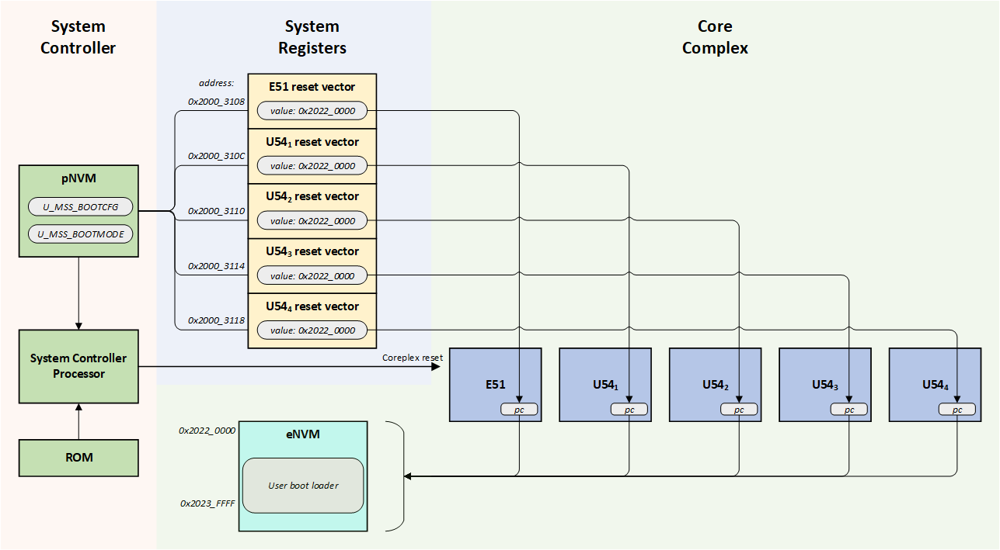

# PolarFire SoC Boot Mode 1

## Overview
PolarFire SoC boot mode 1 is used where the Microprocessor Subsystem (MSS) harts start executing non-secured code from eNVM on power up.

## Boot Mode 1 Sequence
On power up, the PolarFire SoC System Controller starts up and holds the MSS in reset until it has completed configuring the device. It executes ROM code which configures the Core Complex based on configuration data structures stored in its private Non-Volatile Memory (pNVM).

In boot mode 1, the System Controller uses:

- U_MSS_BOOTMODE: determines whether boot mode 0, 1, 2 or 3 is used.
- U_MSS_BOOTCFG: contains boot configuration specific to the requested boot mode. In the case of boot mode 1, it contains the reset vectors for all 5 harts.

For boot mode 1, the System Controller:

1. Reads the value of U_MSS_BOOTMODE and proceeds to the following step if boot mode is 1.
2. Sets the content of the System Registers' reset vector register from the values found in U_MSS_BOOTCFG configuration data structure held in pNVM.
3. Releases the Core Complex reset causing all harts to execute the code found in eNVM. 

 

Notes:

- The System Controller's pNVM content can only be modified through a programming bitstream. The pNVM content is not directly accessible from the Core Complex.
- The MSS/Core Complex default clock configuration is 80MHz using the SCB clock source.
