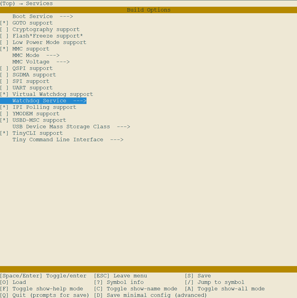
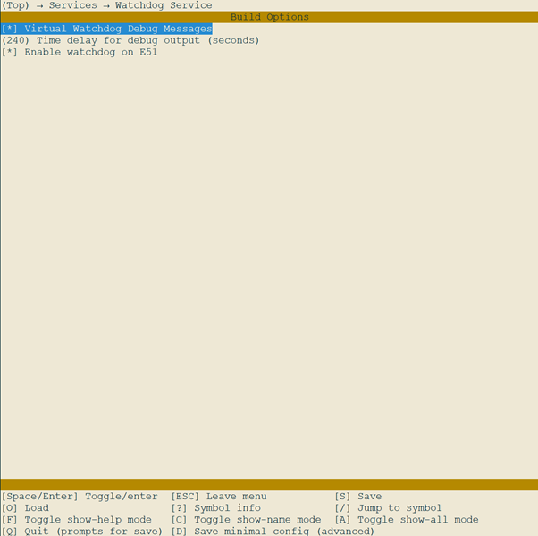
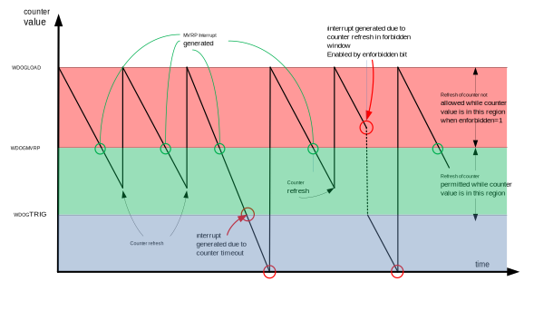

# PolarFire SoC: Hart Software Services Watchdog Service

- [Overview](#overview)
    - [PolarFire SoC Watchdogs](#polarfire-soc-watchdogs)
    - [Relevant KConfig Options](#relevant-kconfig-options)
    - [How to avail of the Watchdog Service in an application](#how-to-avail-of-the-watchdog-service-in-an-application)
        - [Watchdog Operation](#watchdog-operation)
        - [Bare metal](#bare-metal)
        - [Linux example](#linux-example)
    - [Source Code](#source-code)
    - [Watchdog State Machine](#watchdog-state-machine)

This document provides a brief overview of the PolarFire SoC hardware features related to watchdog timers and suggested uses of these features.

Please refer to the [PolarFire SoC Microprocessor Subsystem (MSS) User Guide](https://www.microsemi.com/document-portal/doc_download/1244570-ug0880-polarfire-soc-fpga-microprocessor-subsystem-mss-user-guide) for the detailed description of PolarFire SoC.

# Overview <a name="overview"></a>

PolarFire SoC includes hardware watchdog support to monitor the individual harts when the system is running. The watchdogs ensure that harts can be restarted if they hang due to unrecoverable software errors.

The PolarFire SoC Microprocessor SubSystem (MSS) includes five instances of watchdog timer hardware blocks used to detect system lockups - one each for each of the harts.

To facilitate mixed Asymmetric Multi-Processing (AMP) workloads, the HSS supports monitoring and reacting to the Watchdogs firing.

## PolarFire SoC Watchdogs <a name="polarfire-soc-watchdogs"></a>

PolarFire SoC has a Hart Coreplex with one E51 *monitor* hart, and four U54 *application* harts.

The Hart Software Services (HSS) code for PolarFire SoC includes a superloop monitor running on the E51 monitor hart, which receives requests from the individual U54 application harts to perform certain services on their behalf.

These services are typically implemented as state machine, which are registered with and invoked by a simple state machine engine. Each time around the superloop, each state machine is run to update itself as necessary.


The HSS is responsible for booting the application harts at power-up, but also for re-booting them (individually or collectively) at any stage, should they need or desire to. As a consequence of this, reacting to watchdog events in PolarFire SoC is handled by the HSS. 

A *'virtual watchdog'* monitor is implemented as a HSS state machine service, and its responsibilities are to monitor the status of each of the U54 individual watchdog hardware monitors.  When one of these U54 watchdogs trips, the HSS detects this and will reboot the U54.  If the U54 is part of a boot set (i.e., a grouping of U54s running a common SMP firmware, such as Linux SMP), then all members of the set will be restarted.

## Relevant KConfig Options <a name="relevant-kconfig-options"></a>

Watchdog support is included by default in released HSS builds. Should you wish to build a custom HSS, this section will describe the configuration mechanism to ensure that Watchdog support is enabled.

The HSS is configured using the Kconfig configuration system. A toplevel `.config` file is needed to select what services get compiled in or out of the HSS build. 

Firstly, the toplevel `CONFIG_SERVICE_WDOG` option needs to be enabled ("Virtual Watchdog support" via make config).



This then exposes the sub-options which are dependent on Watchdog support, namely:

* `CONFIG_SERVICE_WDOG_DEBUG` - this enables support for informational/debug messages from the virtual watchdog service;
    * `CONFIG_SERVICE_WDOG_DEBUG_TIMEOUT_SECS` - this feature determines the periodicity (in seconds) that Watchdog debug messages will be output by the HSS;
* `CONFIG_SERVICE_WDOG_ENABLE_E51` - this enables the watchdog for the E51 monitor hart in addition to the U54s, protecting the operation of the HSS itself.



When the E51 watchdog is enabled, the HSS will periodically write to the watchdog to refresh it and prevent it from firing. If, for some reason, the E51 hart locks-up or crashes, the E51 watchdog will reset the entire Hart Coreplex.

## How to avail of the Watchdog Service in an application <a name="how-to-avail-of-the-watchdog-service-in-an-application"></a>

### Watchdog Operation <a name="watchdog-operation"></a>

The MSS Watchdog hardware blocks implement down counters. A refresh forbidden window can be created by configuring the watchdog Maximum Value up to which Refresh is Permitted (MVRP).

When the current value of the watchdog timer is greater than the MVRP value, refreshing the watchdog is forbidden (illustrated in the diagram below as the red shaded area). Attempting to refresh the watchdog timer in the forbidden window will assert a timeout interrupt. 



Refreshing the watchdog between the MVRP value and the Trigger Value (TRIG) will successfully refresh the counter and prevent the watchdog from firing (as illustrated in the green shaded area).

Once the watchdog timer value counts below the TRIG value (illustrated as the light blue area), the watchdog will fire.

### Bare metal <a name="bare-metal"></a>

A bare metal application can use the MSS Watchdog Bare Metal Driver API. This driver provides support for:

 * initializing the MSS watchdog on the U54s;
 * reading the current value and status of the watchdog timer;
 * refreshing the watchdog timer value.

The `MSS_WD_forbidden_status()` function can be used to know whether the watchdog timer is in forbidden window or has crossed it. By default, the forbidden window is disabled. It can be enabled by providing an appropriate value as parameter to the `MSS_WD_configure()` function. When the forbidden window is disabled, any attempt to refresh the watchdog timer (when its value is greater than the MVRP value) is ignored and the counter keeps on down counting.

The current value of the watchdog timer can be read using the `MSS_WD_current_value()` function. This function can be called at any time.

The watchdog timer value is refreshed using the `MSS_WD_reload()` function. The value reloaded into the watchdog timer down-counter is specified at the configuration time with an appropriate value as parameter to the `MSS_WD_get_config()` function.

What follows is a sample application showing the use of the watchdog in a bare metal application:

```
#include "mss_watchdog.h"
mss_watchdog_config_t wd1lo_config;

void u54_1(void)
{
    // read back the current (design time) configuration of the watchdog, which we will
    // overwrite with application specific values
    MSS_WD_get_config(MSS_WDOG1_LO, &wd1lo_config);

    wd1lo_config.forbidden_en = WDOG_ENABLE;
    wd1lo_config.mvrp_val = 0xFFFF000u;

    // we'll now reconfigure the watchdog - the watchdog will now be enabled,
    // after which it cannot be disabled and must instead be periodically
    // refreshed
    //
    MSS_WD_configure(MSS_WDOG1_LO, &wd1lo_config);

    // here is our main loop
    for (;;) {
        do_some_work();

        // we'll now check if we are in a forbidden window
        // if not, we'll refresh the watchdog by reloading its value
        // if for some reason do_some_work() hangs and we do not get here in
        // time, the watchdog will fire, and the HSS will detect it and
        // restart our application...
        //
        if (!MSS_WD_forbidden_status(MSS_WDOG1_LO)) {
            MSS_WD_reload(MSS_WDOG1_LO);
        }
    }
}
```

See `mss_watchdog.h` for more details on interacting with the Watchdog blocks from bare metal code.

### Linux example <a name="linux-example"></a>

Support for interacting with the watchdog via a Linux kernel driver is under development.

## Source Code <a name="source-code"></a>

The Watchdog service source code is found under the `hart-software-services/services` folder:

    hart-software-services
    ├── services (software service state machines)
    │   │   ...
    │   └── wdog
    ...

## Watchdog State Machine <a name="watchdog-state-machine"></a>


The watchdog state machine is very straightforward - starting up by configuring the watchdog for the E51 if enabled, then moving through an idle state into monitoring. Each time around the superloop, this monitoring state will be invoked, which checks the status of each of the U54 watchdogs.

The watchdog state machine interacts with the boot state machine to restart a hart (and any other harts that are in its boot set) if it detects that the hart has not managed to refresh its watchdog in time.
